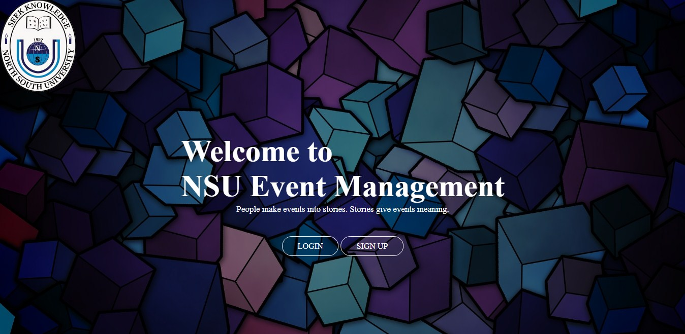

  

Project Name:  NSU Event Management Tool 
Course Name : CSE 299 
Section : 16 
Group Number : 04 
Semester : Summer 2019 
Faculty Name : Shaikh Shawon Arefin Shimon 
Student's Details : 
1) Md. Sadman Ahmed (1620674042) sadman.ahmed16@northsouth.edu 
2) Shafin Ahmed (1621056042) shafin.ahmed@northsouth.edu 
Git Respository Link : https://github.com/sadmanahmed/SU19CSE299S16G04NSU  
Date  : 21/08/2019

## Details:

## 1) Project Idea in brief:

There are many events happenings in NORTH SOUTH UNIVERSITY (NSU). There is no specific dedicated platform to share their details (Yes we have Facebook but it’s not a dedicated platform). There are 23 clubs in NSU and many students chapter as well, also we have Career Placement Centre (CPC) and Office of External Affairs (OEA) and all of them has several events, workshops, seminar, competition and many more. Our prime focus of the website is to make a platform where the users can create an event, update it, delete it and also we will integrate Facebook sharing options here also thus user can share their event from the website also. For Facebook sharing ,we will create a FACEBOOK page for our website and when any event is created ,the page will post about the event details here and we will make a process thus we can share this events in NSU related groups automatically.

This platform can save our valuable times as the event hosts have to continuously post about their events continuously on different groups and also it makes spamming reports from the Facebook users as same posts are posting on the groups continuously and we miss many important posts in the Facebook groups as a normal Facebook user.

By this dedicated platform any users who wants to seek what is happening in NSU can get the details and also can attend it very easily.

One platform, all events.

## 2)Features:

We will have different interface like for Hosts and Users. Every host is a user but not all the users are host. The host has the right to launch an event in the website and also has the ability to update and delete it. But also he has to pay a minimal fee to continue his host status.
The user can only see whatever event is going around him and he doesn’t have any rights to host any events.

The users has to sign up with NSU email id for instant access or they can use normal gmail id but it has to be verified.

## 3)Technology:

We will use Github as project management tool, Trello for different task allocation.
For backend site of this site we will use Ruby and Ruby on Rails framework, PostgreSQL for database management and Frontend part we will use HTML, CSS, BOOT STRAP 4 and other necessary tools and language. We will use sublime text editor also. All of this are free.

## 4)Business Plan:

This website is now only based on North South University. There will be students, faculties and other stuffs. So we have to think sensibly about the payment method.
Now a day mobile banking is becoming popular day by day. That is why we want to apply some mobile banking options like Bkash, Rocket etc. in our website. The payment will be minimal as like 10 or 15 taka per month for the hosts. Every host have to renew their id every month. But for the regular students and other viewers it will be free totally.

# Working Progress

## Front END Development Part

### Landing Page

  

After enter the address of the website, user first of all see this page. Here he or she can login if he or she has already a account here. Otherwise there is also a option for signup.

### Login

  

To enter in to the website, user have to login. Here user can login into the website with his or her nsu email and password.

### Sign Up

  

For a new user, he or she has to register in the website. For this, he or she has to enter his or her name, nsu email and password here. Without nsu email, no one can register in the website as it is only for the students of North South University.

### Home

  

After login or signup, user will get this page. Here he or she can get the option for looking events details, events registration, user account and sign out.

### Events

  

Here user can find the REGISTERED and REGISTRATION option of the events.

### User

  

In this section user will find to see his or her profile through ACCOUNT and also find the SIGN OUT option.

### Registration

  

In this page, an user can create an event. He or she can put the necessary details here like event name, date, details and location. Again he or she can find the payment option here to post an event.

### Registered

  

Here people will find the schedules of different events. They can also know the details also from here.

### Account

We couldn’t  create this section of the website. Hopefully we will think about it as soon as we figure it out.

## Back END Development Part
I have tried a basic html in many backend part to check all the codes I have written is working perfectly or not and our codes this far has been working perfectly like we have added Sign in,sign up,sign out, post creation,show,edit,delete options. I am describing them with pictures here. We have triend a gem called "Devise" and it will automatically handle the database part, authentication and others things.

### Landing Page

  

In this coding part the it actually can redirect Sign in, Sign out,Sign up part of our project. The codes are perfectly working and redirecting to where the buttons are coded to do.

### Sign Up

  

In this part we can take input from the user end and can be saved in our database

### Sign In

  

  

After successfully signed up,we can signout and sign in again successfully with correct password and email address

### Sign out

  

By pressing this button user has been signed out from the session.

### Without Sign In Show

  

Without sign in any user can see the post of this nsu event management website.But they can only see the post.

### Post

  

So when we press the button of new post we will be rediected to a new page where we can input the title and body of the post and can save it in the database.

### Post Showing Page

  

So after the event post created users can see the post from where with a short details and also user name of the emails first part will be shown as user name.

### Show

  

Users can show the details from here.

### Edit

  

Users can edit the post of his/her post and post it again.

### Destroy

  

User can delete the post and we will take confirmation from them before the deletation.
